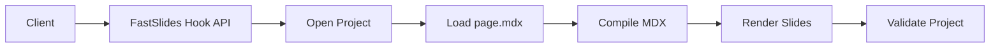
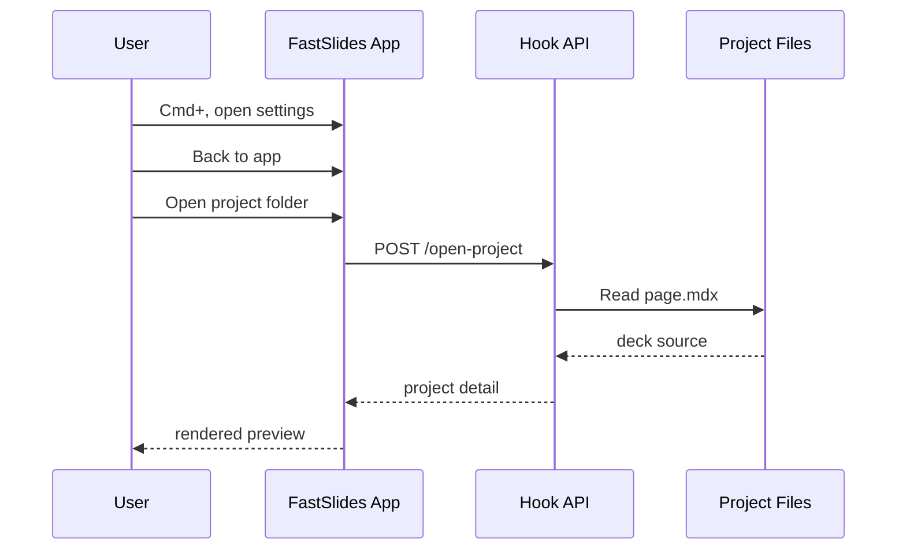
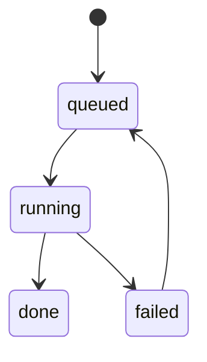

<main className="deck">

<section className="slide">

# Code + Mermaid Lab

<div className="flex flex-col h-full justify-center">
  <div className="text-5xl font-bold text-neutral-900 mb-5">FastSlides rendering check</div>
  <div className="text-2xl text-neutral-500">Code blocks + Mermaid diagrams in one deck</div>
</div>

</section>

<section className="slide">

# TypeScript code block

```ts
// Simple LRU cache for API payloads
class TinyLru<K, V> {
  private limit: number;
  private map = new Map<K, V>();

  constructor(limit = 4) {
    this.limit = Math.max(1, limit);
  }

  get(key: K): V | undefined {
    const value = this.map.get(key);
    if (value === undefined) return undefined;
    this.map.delete(key);
    this.map.set(key, value);
    return value;
  }

  set(key: K, value: V): void {
    if (this.map.has(key)) this.map.delete(key);
    this.map.set(key, value);
    if (this.map.size > this.limit) {
      const firstKey = this.map.keys().next().value as K;
      this.map.delete(firstKey);
    }
  }
}
```

</section>

<section className="slide">

# Mermaid flowchart



</section>

<section className="slide">

# Mermaid sequence diagram



</section>

<section className="slide">

# Mixed slide: code + Mermaid

<div className="split">
  <div className="col prose-compact">

```py
from dataclasses import dataclass

@dataclass
class Job:
    id: str
    status: str = "queued"

    def run(self) -> str:
        self.status = "done"
        return f"job={self.id} status={self.status}"
```

  </div>
  <div className="col prose-compact">



  </div>
</div>

</section>

<section className="slide">

# Constrained primitives

<Stack gap="lg">
  <Grid cols={3} gap="md">
    <Metric label="MDX mode" value="Runtime" hint="Content-only decks" />
    <Metric label="Layout API" value="Constrained" hint="Stack / Row / Grid" />
    <Metric label="Visual QA" value="Screenshots" hint="Playwright-powered" />
  </Grid>

  <Row gap="md" align="stretch">
    <Card title="Consistency" subtitle="Shared card tokens" tone="accent">
      Component cards, metrics, and captions all inherit from `slides.css`.
    </Card>
    <Card title="Safety" subtitle="Reduced layout drift" tone="success">
      Agents use bounded primitives instead of ad-hoc utility class mixtures.
    </Card>
  </Row>

  <Caption>
    Use `--slide-layout-gap`, `--slide-card-*`, and `--slide-meta-*` tokens to keep decks uniform.
  </Caption>
</Stack>

</section>

<section className="slide">

# Expected result

<div className="prose-compact">

- Code fences should show as formatted code blocks.
- Mermaid fences should render as diagrams (not plain text blocks).
- If Mermaid renders as raw code, plugin support likely regressed.

</div>

</section>

</main>
