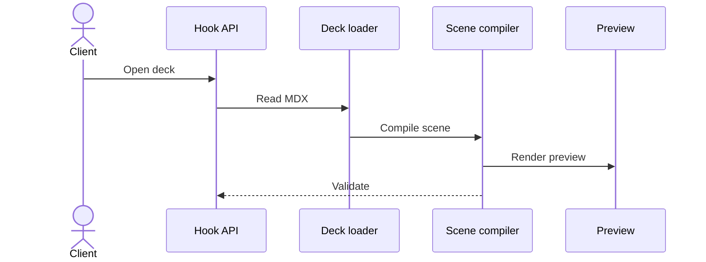
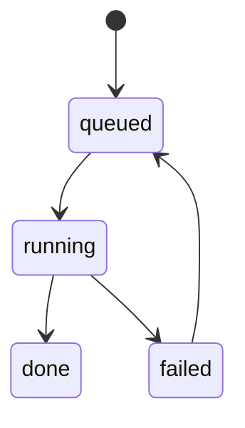

<main className="deck">

<section className="slide">
  <Canvas cols={50} rows={25} gap="1px">
    <Area x={2} y={2} w={15} h={1}>
      <Kicker>Render lab</Kicker>
    </Area>

    <Area x={2} y={4} w={30} h={5}>
      <Takeaway>FastSlides needs to prove code fences and Mermaid diagrams inside the same spatial slide system.</Takeaway>
    </Area>

    <Area x={2} y={10} w={18} h={3}>
      <p>This deck is a regression harness for code formatting, diagram rendering, and mixed evidence layouts.</p>
    </Area>

    <Area x={2} y={16} w={20} h={2}>
      <PillRow>
        <Pill>code blocks</Pill>
        <Pill>mermaid</Pill>
        <Pill>spatial canvas</Pill>
      </PillRow>
    </Area>

    <Area x={34} y={5} w={14} h={12}>
      <Callout title="What should never regress" tone="accent">
        Syntax highlighting, diagram rendering, and region alignment should survive runtime and theme changes.
      </Callout>
    </Area>
  </Canvas>
</section>

<section className="slide">
  <Canvas cols={50} rows={25} gap="1px">
    <Area x={2} y={2} w={18} h={1}>
      <Kicker>Code fence</Kicker>
    </Area>

    <Area x={2} y={4} w={27} h={4}>
      <Takeaway>Code-heavy slides should still feel composed when the page uses the same region system as narrative slides.</Takeaway>
    </Area>

    <Area x={2} y={10} w={28} h={12}>
      <Panel title="TypeScript example" tone="accent">
```ts
// Simple LRU cache for API payloads
class TinyLru<K, V> {
  private limit: number;
  private map = new Map<K, V>();

  constructor(limit = 4) {
    this.limit = Math.max(1, limit);
  }

  get(key: K): V | undefined {
    const value = this.map.get(key);
    if (value === undefined) return undefined;
    this.map.delete(key);
    this.map.set(key, value);
    return value;
  }
}
```
      </Panel>
    </Area>

    <Area x={33} y={10} w={15} h={12}>
      <Callout title="Check">
        Line spacing, code font choice, and container padding should all remain readable at presentation distance.
      </Callout>
    </Area>
  </Canvas>
</section>

<section className="slide">
  <Canvas cols={50} rows={25} gap="1px">
    <Area x={2} y={2} w={19} h={1}>
      <Kicker>Diagram fence</Kicker>
    </Area>

    <Area x={2} y={4} w={28} h={4}>
      <Takeaway>Mermaid should render as a first-class exhibit, not as raw text that leaks through the page.</Takeaway>
    </Area>

    <Area x={2} y={10} w={31} h={12}>
      <Panel title="Render handshake" tone="accent">

```mermaid
sequenceDiagram
  actor Client
  participant Hook as Hook API
  participant Loader as Deck loader
  participant Engine as Scene compiler
  participant Preview

  Client->>Hook: Open deck
  Hook->>Loader: Read MDX
  Loader->>Engine: Compile scene
  Engine->>Preview: Render preview
  Engine-->>Hook: Validate
```
      </Panel>
    </Area>

    <Area x={35} y={10} w={13} h={12}>
      <Callout title="Check">
        Diagram scale, label legibility, and stroke contrast need to hold without manual SVG cleanup.
      </Callout>
    </Area>
  </Canvas>
</section>

<section className="slide">
  <Canvas cols={50} rows={25} gap="1px">
    <Area x={2} y={2} w={21} h={1}>
      <Kicker>Mixed evidence</Kicker>
    </Area>

    <Area x={2} y={4} w={29} h={4}>
      <Takeaway>A slide can show code and a diagram together, but the comparison has to happen inside explicit regions.</Takeaway>
    </Area>

    <Area x={2} y={10} w={20} h={12}>
      <Panel title="Python snippet" tone="accent">
```py
from dataclasses import dataclass

@dataclass
class Job:
    id: str
    status: str = "queued"

    def run(self) -> str:
        self.status = "done"
        return f"job={self.id} status={self.status}"
```
      </Panel>
    </Area>

    <Area x={24} y={10} w={24} h={12}>
      <Panel title="State diagram">

```mermaid
stateDiagram-v2
  [*] --> queued
  queued --> running
  running --> done
  running --> failed
  failed --> queued
```
      </Panel>
    </Area>
  </Canvas>
</section>

<section className="slide">
  <Canvas cols={50} rows={25} gap="1px">
    <Area x={2} y={2} w={18} h={1}>
      <Kicker>Primitive check</Kicker>
    </Area>

    <Area x={2} y={4} w={30} h={4}>
      <Takeaway>The same deck should exercise primitive layouts, metrics, and captions without dropping back to legacy HTML patterns.</Takeaway>
    </Area>

    <Area x={2} y={10} w={30} h={10}>
      <Grid cols={3} gap="md">
        <Metric label="MDX mode" value="Runtime" hint="Content-only decks" />
        <Metric label="Layout API" value="Canvas-first" hint="Area plus bounded primitives" />
        <Metric label="Visual QA" value="Screenshots" hint="Playwright-powered" />
      </Grid>
    </Area>

    <Area x={34} y={10} w={14} h={10}>
      <Callout title="Check" tone="accent">
        Metrics, captions, and internal grids should align cleanly inside one region without growing random borders or side accents.
      </Callout>
    </Area>

    <Area x={2} y={21} w={30} h={2}>
      <Caption>Theme tokens should style every primitive consistently across light and dark decks.</Caption>
    </Area>
  </Canvas>
</section>

<section className="slide">
  <Canvas cols={50} rows={25} gap="1px">
    <Area x={2} y={2} w={16} h={1}>
      <Kicker>Expected result</Kicker>
    </Area>

    <Area x={2} y={4} w={30} h={4}>
      <Takeaway>If this deck passes, the runtime can handle code, diagrams, and structured regions without falling back to legacy layout tricks.</Takeaway>
    </Area>

    <Area x={2} y={10} w={18} h={11}>
      <Panel title="What success looks like" tone="accent">
        <ul>
          <li>Code fences render with syntax highlighting.</li>
          <li>Mermaid blocks render as diagrams.</li>
          <li>Regions align and do not clip.</li>
          <li>The deck validates cleanly.</li>
        </ul>
      </Panel>
    </Area>

    <Area x={23} y={10} w={10} h={5}>
      <Metric label="QA loop" value="validate" hint="then inspect" />
    </Area>

    <Area x={23} y={16} w={10} h={5}>
      <Metric label="Failure mode" value="raw code" hint="means diagram support regressed" />
    </Area>

    <Area x={35} y={10} w={13} h={11}>
      <Callout title="Operator note">
        When something fails here, fix the runtime or theme system, not the sample deck by hand-waving around the regression.
      </Callout>
    </Area>
  </Canvas>
</section>

</main>
